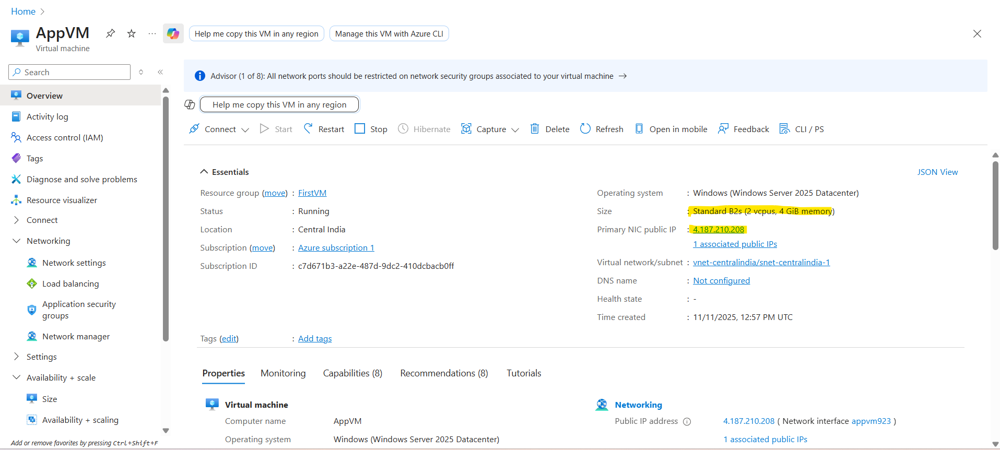
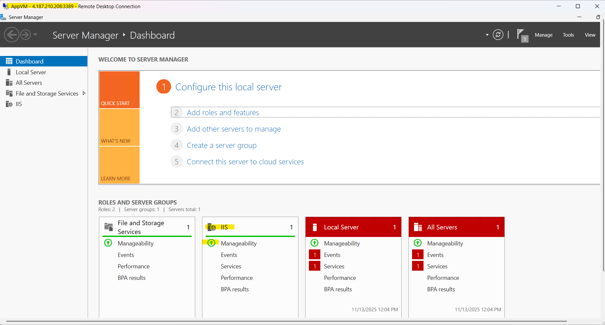
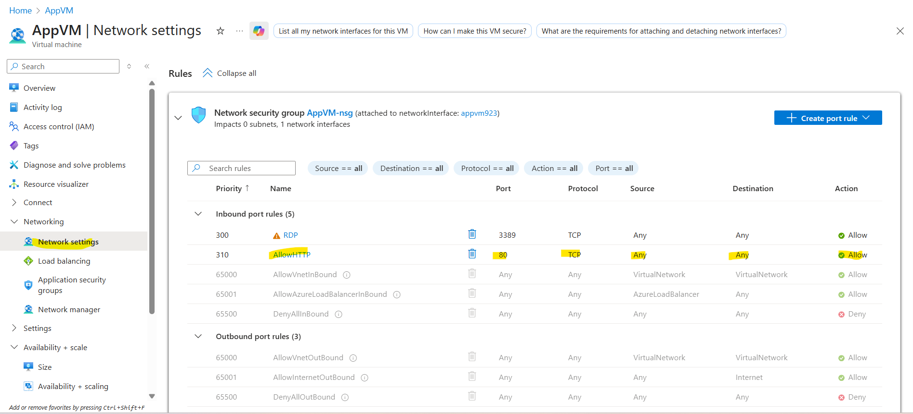
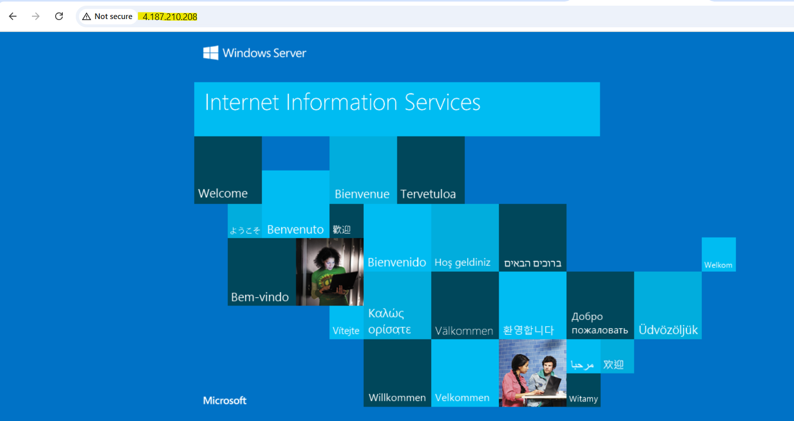

# Lab 02: Configure and Secure a Windows VM with IIS (AZ-104)

## Objective
Extend the Windows VM from Lab 01 by resizing it for better performance, connecting via RDP, installing Internet Information Services (IIS) as a web server, and securing inbound traffic with a Network Security Group (NSG) rule for HTTP (port 80). This lab covers Azure Compute (VM sizing/management), Networking (NSGs), and basic app deployment—key for AZ-104 Module 2: Implement and Manage Storage/Compute.

**Learnings**: 
- VM sizing impacts usability (e.g., B1s lacks resources for RDP).
- NSGs are stateful firewalls; inbound rules must explicitly allow traffic.
- IIS is a quick way to test web hosting on Windows VMs.

**Time**: 30-45 mins.  
**Cost**: ~$0.02/hour for B2s (monitor in Azure Cost Management).  
**Prerequisites**: Complete Lab 01 (running Windows Server 2025 Datacenter VM in Central India).

## Steps

### Step 1: Resize the VM for RDP Compatibility
The default B1s size (1 vCPU, 1 GiB RAM) often causes RDP timeouts due to low resources.

1. In Azure Portal > Virtual Machines > Select your VM (e.g., "AppVM").
2. Click **Size** > **Resize**.
3. Search for "B2s" (2 vCPUs, 4 GiB RAM—burstable, cost-effective).
4. Click **Resize** (VM restarts automatically).



**Tip**: Use Azure Advisor (in the portal) for sizing recommendations—it's free and proactive.

### Step 2: Connect via RDP
1. In VM overview > Click **Connect** > **RDP** > Download the .rdp file.
2. Open in Remote Desktop Connection (Windows) or Microsoft Remote Desktop (Mac).
3. Use Azure-provided credentials (username: your admin user; password: from Lab 01).
4. Connect—expect a quick handshake if resized properly.



**Troubleshooting**: If timeout persists, check NSG for RDP (port 3389) allow rule and public IP accessibility.

### Step 3: Install IIS Web Server
1. In RDP session > Open **Server Manager** > **Manage** > **Add Roles and Features**.
2. Quick Start > **Next** > Select **Role-based or feature-based installation**.
3. Select your server > **Next** > Check **Web Server (IIS)** under Server Roles.
4. Add required features (e.g., HTTP Activation if prompted) > **Install**.
5. Verify: Open PowerShell as admin > `Get-WindowsFeature | Where-Object {$_.Name -like "*IIS*"}` (should show "Installed").

**SRE Note**: For production, use ARM templates or DSC for automated IIS installs—manual is fine for labs.

### Step 4: Configure NSG for HTTP Access
By default, NSGs block inbound HTTP. Your VM's public IP (e.g., 4.187.210.208) needs port 80 open.

1. In Azure Portal > VM > **Networking** > Click the NSG name (e.g., "appvm-nsg").
2. **Inbound port rules** > **+ Add**.
3. Source: Any; Destination: Any; Service: HTTP (port 80); Action: Allow; Priority: 310 (higher than deny rules).
4. Save.



**Security Best Practice**: Use priority numbering (100-4096) to control rule order. Deny rules (e.g., "DenyAllInbound") should be lowest priority.

### Step 5: Verify IIS Deployment
1. From your local browser: `http://<public-ip>` (e.g., http://4.187.210.208).
2. See the IIS welcome page.



**Troubleshooting**: Check VM's Windows Firewall (inbound rules for IIS) and NSG effective rules.

## Cleanup
Delete resources to avoid costs:
- Stop/Deallocate VM > **Delete** (or use script below).
- Remove NSG rules if reusing.

**PowerShell Cleanup Script** (run in Azure Cloud Shell):
```powershell
# Connect to Azure: Connect-AzAccount
$vmName = "AppVM"
$rgName = "FirstVM"
Remove-AzVM -ResourceGroupName $rgName -Name $vmName -Force
Remove-AzNetworkSecurityGroup -ResourceGroupName $rgName -Name "appvm-nsg" -Force  # Optional
