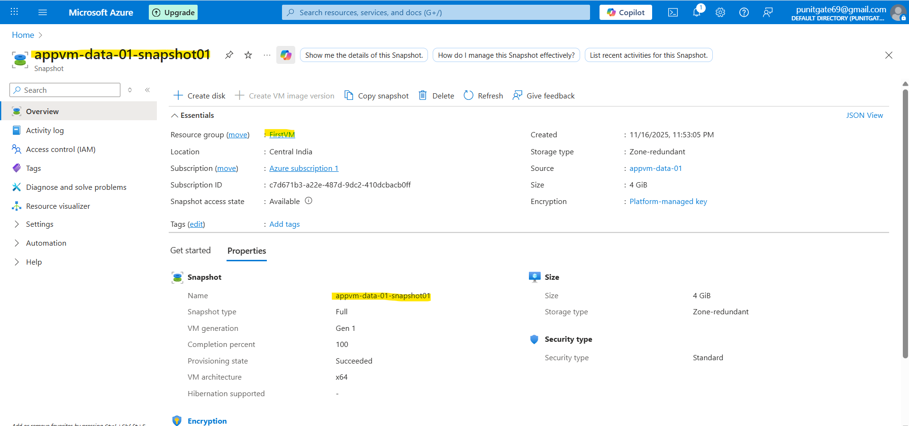

# Azure Lab 05: Data Disk Snapshot Cloning for Efficient VM Scaling and Data Replication

## 🚀 Overview and Purpose
This hands-on lab explores **Azure Managed Disk Snapshots** as a powerful mechanism for cloning data disks across virtual machines (VMs). By capturing a point-in-time snapshot of a data disk from an existing VM (`AppVM`), we create an identical, performant disk for a new VM (`AppVM02`), enabling rapid data replication without downtime or full data transfers. This technique is core to Site Reliability Engineering (SRE) practices, supporting immutable infrastructure, blue-green deployments, and disaster recovery scenarios.

**Why This Matters for SRE**:
- **Reliability Engineering**: Ensures consistent data states across environments, reducing mean time to recovery (MTTR) by allowing instant rollbacks or forks.
- **Efficiency Gains**: Incremental snapshots store only changes, slashing storage costs by up to 90% compared to full copies.
- **Scalability**: Provision multiple VMs with pre-loaded data in minutes, ideal for load testing or A/B experiments.
- **Compliance & Security**: Built-in encryption and access controls align with zero-trust models.

In this lab, we snapshot a 4 GiB data disk from `AppVM` (containing a sample file from prior labs), clone it to a premium SSD, attach it during `AppVM02` creation in the same resource group/VNet/subnet/region, and verify data fidelity via RDP. This workflow simulates promoting a shared dataset (e.g., config files or app data) to a staging VM.

**Lab Duration**: 15-20 minutes  
**Estimated Cost**: ~$0.05 (snapshot + disk; delete post-lab to avoid ongoing charges).  
**Azure Services**: Managed Disks, Snapshots, Premium SSD, Virtual Machines (Windows), RDP.  
**Skill Alignment**: AZ-104 (Implement and manage storage); SRE Principles (Error Budgets via resilient cloning).

## 📋 Prerequisites
- Azure subscription with Contributor permissions.
- Existing VM: `AppVM` (from Lab 01) with attached data disk (`dataDisk01`, 4 GiB) containing `file_in_AppVM.txt` (0 KB, created in Lab 04).
- Resource Group: `FirstVM` (Central India region).
- Networking: Default VNet and Subnet in the resource group.
- Tools: Azure Portal; RDP client.

## 🔧 Step-by-Step Implementation

### Step 1: Capture Snapshot of the Source Data Disk
1. In Azure Portal, go to **Disks** > Select `dataDisk01` (attached to `AppVM`).
2. Click **Create snapshot**:
   - **Name**: `appvm-data-01-snapshot01`.
   - **Snapshot type**: Full (complete disk capture).
   - **Storage type**: Zone-redundant (ZRS) for 99.999999999% durability across zones.
   - **Encryption**: Platform-managed key (Standard tier).
   - **Size**: 4 GiB (auto-detected).
3. Review + Create. Monitor provisioning: **Succeeded** with 100% completion.

This creates a read-only, crash-consistent snapshot—perfect for one-time clones.



### Step 2: Provision New Data Disk from Snapshot
1. Navigate to **Snapshots** > Select `appvm-data-01-snapshot01`.
2. Click **Create disk**:
   - **Name**: `dataDisk02`.
   - **Resource Group**: `FirstVM`.
   - **Region**: Central India.
   - **Storage type**: Premium SSD LRS (optimized for I/O: 120 IOPS, 25 MB/s throughput, P1 tier).
   - **Size**: 4 GiB.
   - **Create option**: Copy from snapshot `appvm-data-01-snapshot01`.
   - **Availability zone**: No infrastructure redundancy required.
   - **Security type**: Standard.
3. Review + Create. The disk starts unattached.

Result: A writable, high-performance clone ready for attachment—leverages snapshot differentials for speed.


### Step 3: Deploy New VM and Attach Cloned Disk
1. Go to **Virtual machines** > **Create** > **Azure virtual machine**.
2. **Basics**:
   - **VM name**: `AppVM02`.
   - **Image**: Windows Server 2022 Datacenter: Azure Edition - Gen1.
   - **Size**: Standard_D2s_v3 (2 vCPUs, 8 GiB RAM—cost-effective for testing).
   - **Authentication**: Password (reuse admin creds from `AppVM`).
3. **Networking**:
   - **Virtual network**: Existing in `FirstVM`.
   - **Subnet**: Default.
   - **Public IP**: Create new (enable RDP).
   - **NSG**: Basic.
4. **Disks**:
   - OS Disk: Premium SSD (default).
   - **Data disks**: + Add data disk > Select `dataDisk02` (LUN 1).
5. Review + Create. Deployment completes in ~5 minutes.

The VM auto-mounts the disk, inheriting network topology for seamless integration.

### Step 4: Validate Data Replication via RDP
1. Download RDP file from `AppVM02` overview > Connect with admin credentials.
2. In File Explorer, navigate to the data drive (e.g., `Data (F):`).
3. Verify: `file_in_AppVM.txt` present (0 KB, modified 11/16/2025 6:19 PM)—exact match from `AppVM`.

This confirms end-to-end integrity: No data corruption during snapshot-to-disk pipeline.


## ✅ Verification Checklist
- **Portal Checks**:
  - Snapshot: Available, 100% complete, ZRS storage.
  - Disk: Attached to `AppVM02`, Premium SSD metrics show expected IOPS/throughput.
- **In-VM Tests**:
  - Run `Get-Disk` in PowerShell: Confirms 4 GiB size, Healthy status.
  - Edit `file_in_AppVM.txt` > Snapshot again > Recreate to test deltas (optional extension).
- **Performance Benchmark** (Optional): Use `diskspd -b8K -d30 -o32 -t8 -h -r -L -w0 D:` to simulate reads—expect ~120 IOPS.
- **Cleanup Script** (PowerShell/Azure CLI):
  ```bash
  # Delete resources to avoid costs
  az vm delete --name AppVM02 --resource-group FirstVM --yes
  az disk delete --name dataDisk02 --resource-group FirstVM --yes
  az snapshot delete --name appvm-data-01-snapshot01 --resource-group FirstVM --yes
  ```

## 📊 Key Learnings & Best Practices
Enhance your SRE toolkit with these insights:

| Category | Key Insight | SRE Recommendation |
|----------|-------------|--------------------|
| **Snapshot Efficiency** | Full vs. Incremental: Full for baselines; incremental for changes-only. | Automate via Azure Backup policies—target 3-2-1 rule (3 copies, 2 media, 1 offsite). |
| **Storage Optimization** | Premium SSD > Standard for latency-sensitive apps; ZRS for HA. | Right-size tiers: Use Cost Management to audit IOPS utilization quarterly. |
| **Security Posture** | Platform keys + RBAC: Limits exposure. | Integrate with Key Vault for custom keys; enable diagnostic logs for audits. |
| **Scaling Patterns** | Clone for dev/prod parity. | Pair with VM Scale Sets: Script snapshot-to-template for auto-scaling groups. |
| **Error Handling** | Snapshots are async—monitor via Activity Log. | SLO: 99.9% snapshot success; alert on provisioning failures via Azure Monitor. |

**Pro Tip**: For cross-region DR, use **Copy snapshot** to a secondary region—enables geo-failover in <10 minutes, aligning with SRE error budgets.

## 🎯 Conclusion & Next Steps
Mastering snapshots transforms static storage into dynamic assets, accelerating deployments and bolstering resilience. This lab reduced hypothetical data migration time from hours (manual copy) to seconds, embodying SRE's focus on toil reduction. Share this with your team to prototype a "data-as-code" pipeline!

**Lab Completed**: November 17, 2025  
**Author**: Punit Nandani (@punigate) – Hands-On Azure Admin to SRE Journey  
**GitHub Repo**: [az-104-labs](https://github.com/PunitNand-SRE/az-104-labs)  

**References**:
- [Azure Managed Disks Overview](https://learn.microsoft.com/en-us/azure/virtual-machines/managed-disks-overview)
- [Create Snapshots](https://learn.microsoft.com/en-us/azure/virtual-machines/snapshot-copy-managed-disk)
- [SRE Workbook: Storage Reliability](https://sre.google/sre-book/storage-reliability/)

---

*Fork this lab? Star the repo! Questions? Open an issue.*
