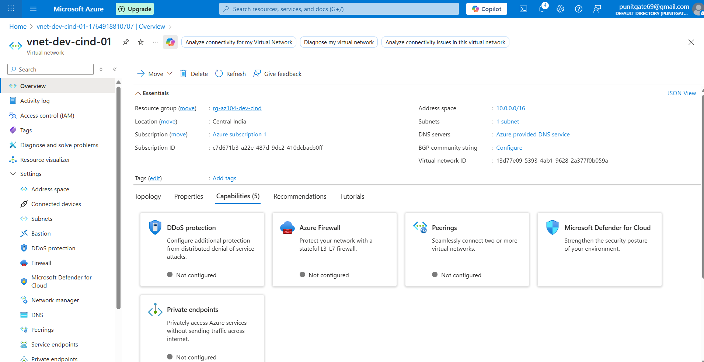
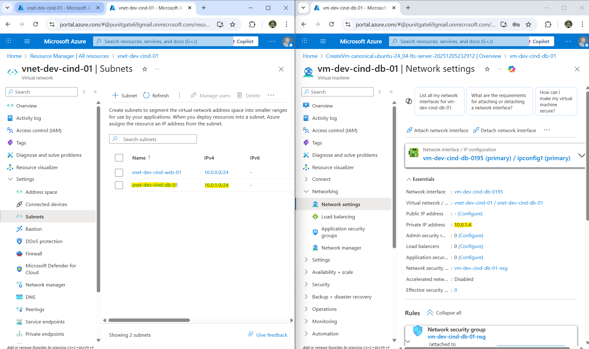
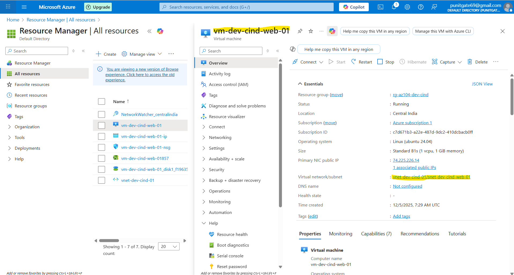
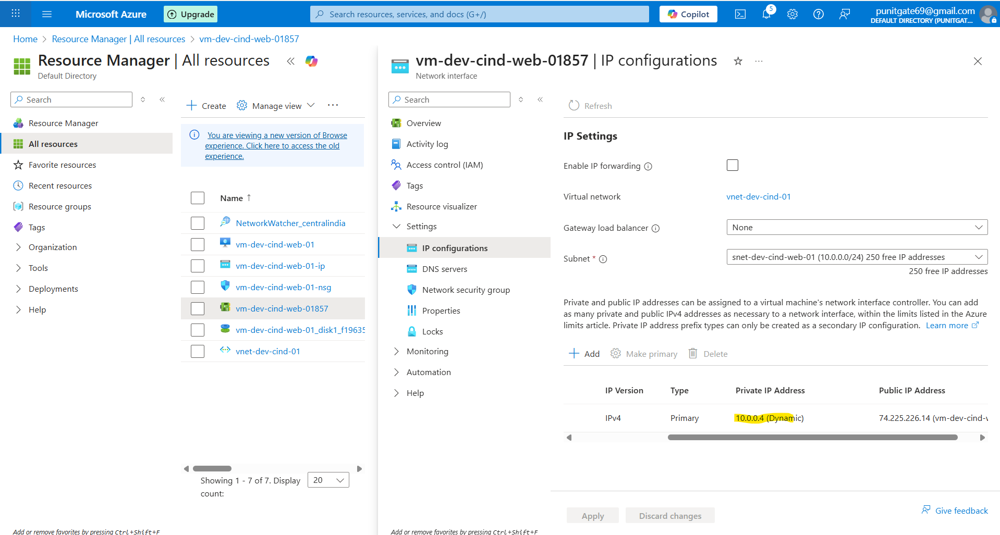

# Lab 12: Azure Virtual Network Design with Multi-Subnet Architecture (Web & DB Tier Isolation)

---

## 📌 Overview

In this lab, I designed and implemented a **custom Azure Virtual Network (VNet)** with **multiple subnets** to simulate a **real-world, production-style application architecture**.

Instead of relying on Azure’s default networking during VM creation, the network was **explicitly designed first**, followed by deploying virtual machines into appropriate subnets based on their role (Web vs Database).

This approach mirrors how **enterprises and SRE teams design secure, scalable, and maintainable cloud networks**.

---

## 🎯 Objective

* Understand **why VNets are required in enterprise environments**
* Design a **multi-subnet network architecture**
* Deploy:

  * A **Web VM** with public access
  * A **Database VM** with **no public exposure**
* Understand:

  * IP addressing
  * Subnetting
  * CIDR
  * NIC behavior
* Apply **security-first and SRE-oriented networking principles**

---

## 🏢 Why Companies Need a Virtual Network (VNet)

In real organizations:

* Applications **must not run on public networks**
* Traffic must be **controlled, inspected, and segmented**
* Teams need:

  * Predictable IP addressing
  * Isolation between tiers (Web, App, DB)
  * Secure internal communication

An **Azure Virtual Network (VNet)** provides:

* A **private, isolated network** in Azure
* Full control over:

  * IP ranges
  * Subnets
  * Routing
  * Security rules

> 💡 **SRE perspective:**
> A well-designed VNet reduces outages, limits blast radius, and simplifies troubleshooting.

---

## 🌐 VNet Design Used in This Lab

### Virtual Network Details

* **VNet Name:** `vnet-dev-cind-01`
* **Address Space:** `10.0.0.0/16`
* **Region:** Central India
* **Resource Group:** `rg-az104-dev-cind`

This address space allows **65,536 private IP addresses**, giving room for future growth.

### VNet Overview



---

## 🧠 Networking Fundamentals (Core Concepts)

### 1️⃣ IP Address

An **IP address** uniquely identifies a resource in a network.

Example:

* Web VM private IP: `10.0.0.4`
* DB VM private IP: `10.0.1.4`

> SRE relevance: IP consistency is critical for monitoring, firewall rules, and incident debugging.

---

### 2️⃣ CIDR (Classless Inter-Domain Routing)

CIDR defines how many IPs a network contains.

Examples used:

* `10.0.0.0/16` → VNet
* `10.0.0.0/24` → Web Subnet
* `10.0.1.0/24` → DB Subnet

| CIDR | Total IPs |
| ---- | --------- |
| /16  | 65,536    |
| /24  | 256       |

---

### 3️⃣ Subnet

A **subnet** divides a VNet into smaller logical networks.

Why subnets matter:

* Security isolation
* Traffic control
* Clear role separation

---

## 🧩 Subnet Architecture (Web & DB Tier)

| Subnet Name            | Address Range | Purpose       |
| ---------------------- | ------------- | ------------- |
| `snet-dev-cind-web-01` | `10.0.0.0/24` | Web tier      |
| `snet-dev-cind-db-01`  | `10.0.1.0/24` | Database tier |

### Subnet View



---

## 🖥️ Web Tier VM Deployment

### Web VM Details

* **VM Name:** `vm-dev-cind-web-01`
* **Subnet:** `snet-dev-cind-web-01`
* **Private IP:** `10.0.0.4`
* **Public IP:** Assigned
* **Purpose:** Internet-facing application server

### Web VM Overview



---

## 🔌 Network Interface (NIC) Behavior

When a VM is created, Azure automatically creates:

* A **Network Interface (NIC)**
* Assigns:

  * Private IP from the subnet
  * Optional public IP

### NIC IP Assignment



**Key observation:**

* The IP `10.0.0.4` was dynamically assigned from `10.0.0.0/24`

> 💡 **AZ-104 exam tip:**
> NICs, not VMs, are associated with IPs and NSGs.

---

## 🛢️ Database Tier VM Deployment (Secure by Design)

### DB VM Details

* **VM Name:** `vm-dev-cind-db-01`
* **Subnet:** `snet-dev-cind-db-01`
* **Private IP:** `10.0.1.4`
* **Public IP:** ❌ None
* **Purpose:** Internal database server

### Why No Public IP?

* Prevents internet exposure
* Reduces attack surface
* Enforces access only from Web tier

> 🔐 **SRE principle:**
> “Private by default, public only when required.”

---

## 🔐 Security & SRE Design Principles Applied

✔ Network segmentation
✔ Principle of least exposure
✔ Clear tier separation
✔ Scalable IP planning
✔ Real-world enterprise pattern

---

## 🔁 Traffic Flow (End-to-End)

```
Internet
   |
   | (Public IP)
   v
Web VM (10.0.0.4)
   |
   | (Private VNet traffic)
   v
DB VM (10.0.1.4)
```

---

## 🧪 Verification

* Web VM accessible via public IP
* DB VM **not reachable** from internet
* Web VM can communicate with DB VM internally
* IPs correctly allocated from respective subnets

---

## 🧹 Cleanup (Cost Control)

To avoid unnecessary Azure costs:

* Delete resource group: `rg-az104-dev-cind`

---

## 📚 AZ-104 Skills Covered

* Virtual Network design
* Subnet planning
* CIDR calculation
* NIC behavior
* Secure VM deployment
* Public vs private IP usage

---

## 🚀 Why This Lab Matters for an SRE Role

This lab demonstrates:

* Intentional architecture (not defaults)
* Security-aware design
* Troubleshooting-ready layout
* Production-grade thinking

> This is **exactly how real systems are built and reviewed** by SRE and Cloud Engineering teams.
